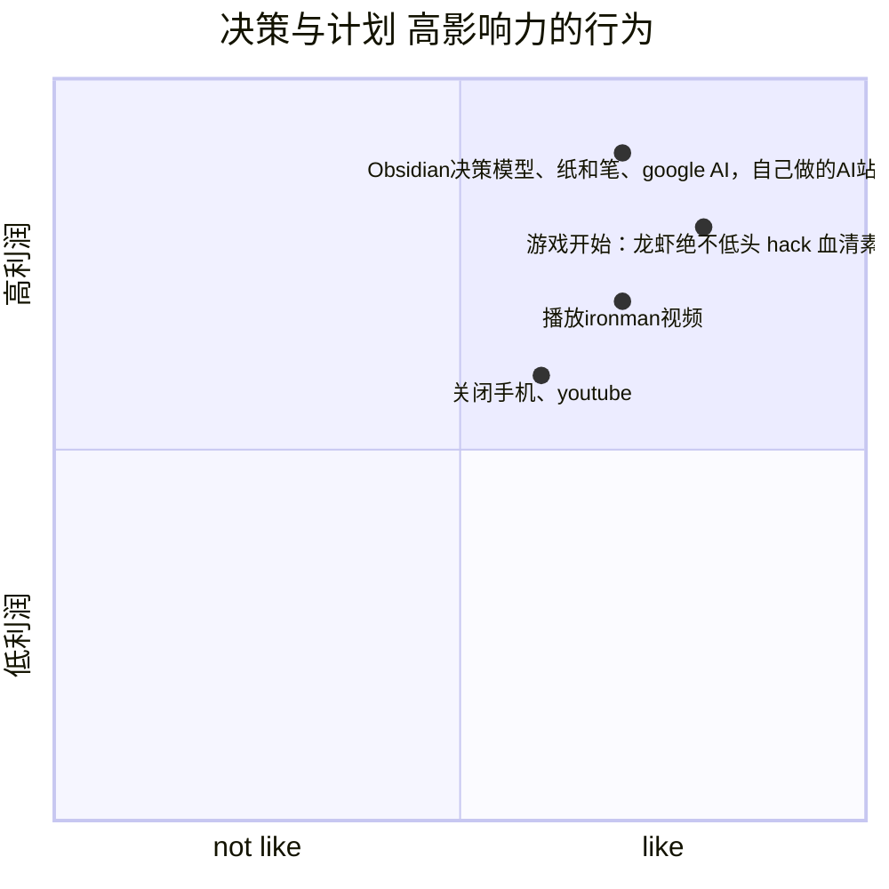

# 动机： 厘清愿望 （aspiration）、 成果（outcome）和行为（behavior）三者之间的区别。

Behavior=Motivation Ability Prompt

* 愿望：重要性和客观事实去安排时间和行动
* 成果：最好可以有一个客观的值可以衡量自己的安排时间足够合理。

# 行动集群：
* Obsidian决策模型、纸和笔、google AI，自己做的AI站

## Person prompt人物提醒:

身体的 本能就是最自然的人物提示。身体会提醒我们做出本能反应，
* example:
    * 比如肚子饿、困倦和想上厕所。
    * 吃饭的时刷anki

## Context prompt提醒

周围环境中的任何事物都可以

* 作为采取行动的提示：便利贴、App通知、电话铃声、提醒你参加 会议的同事。

情境提示有时是有用的，但它也有可能会带来压力。管理好提示 是现代生活中人们所面临的一大挑战。

我的书房里有一个大白板，上面罗列着许多待办项目，不同项目 有不同的颜色标记。为了管理它带来的视觉和心理上的压力，我用一块布遮住了那些当前不用做的事情，只露出需要当天完成的事情的提示。我发现遮住其他事情的提示能让我更冷静、更专注。如果你设置 的情境提示没有效果，可能并不是因为你做错了什么，或者缺少动机 或意志力。请不要责怪自己。你只需重新设计提示，找出对你有用的提示。

## Action prompt提醒:

每天的行为习惯中hook注入点

* 注入点3要素:
    * 时间
    * 行为
    * 地点

### example

* 在早上起床刷牙后,加入牙线行为
* 当洗澡护肤时,
    * 打开(打印)你喜欢的书,
    * 把电脑当作背景音乐
    * 关闭推荐系统所有的东西.
    * 播放你喜欢的音乐
    * 拿起笔
* 奖励:?

* 原则: [[#缩小习惯和规模]],缩小规模行动.

### step1找到注入hook点

* 拿1张A4纸从早上起床到晚上睡觉0-24点,列出所有的行为习惯hook注入点

* 晨间日程：
    *  在我睡醒下床之后，我会……
    *  在我从床上坐起来之后，我会……
    *  在我关掉闹钟之后，我会……
    *  在我上完厕所之后，我会……
    *  在我冲完厕所之后，我会……
    *  在我打开淋浴之后，我会……
    *  在我刷完牙之后，我会……
    *  在我梳完头之后，我会……
    *  在我铺好床之后，我会……
    *  在我穿好鞋之后，我会……
    *  在我打开咖啡机之后，我会……
    *  在我倒了一杯咖啡之后，我会……
    *  在我把餐具放进洗碗机之后，我会……
    *  在我喂完狗之后，我会……
    *  在我插入钥匙启动汽车之后，我会……
* 午间（或任何日间）日程
    *  在我听到电话铃声之后，我会……
    *  在我挂断电话之后，我会……
    *  在我喝完一杯咖啡之后，我会…… 
    *  在我清空邮箱的收件箱之后，我会……
    *  在我上完厕所之后，我会……
* 晚间日程：
    *  在我下班进入家门之后，我会……
    *  在我挂好钥匙之后，我会……
    *  在我放下钱包之后，我会……
    *  在我挂好狗绳之后，我会……
    *  在我坐下来准备吃饭之后，我会……
    *  在我把餐具放进洗碗机之后，我会……
    *  在我启动洗碗机之后，我会……
    *  在我关掉电视之后，我会…

* [[fogg_behavior_model/behavior_hook_list]]

